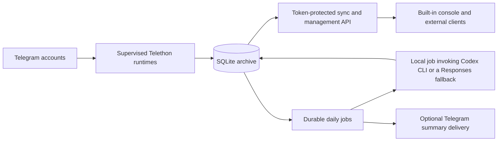

# tele-mess-core

[](https://github.com/dreaifekks/tele-mess-core/actions/workflows/ci.yml)
[](https://pypi.org/project/tele-mess-core/)
[](https://pypi.org/project/tele-mess-core/)
[](https://github.com/dreaifekks/tele-mess-core/blob/master/LICENSE)

**A local-first Telegram archive and Codex analysis engine that keeps message
history on infrastructure you control.**

`tele-mess-core` supervises multiple Telegram accounts, stores messages and
media metadata in SQLite, catches up safely after reconnects, and exposes a
token-protected sync and management API. Durable local jobs turn the archive
into source-linked daily reports and structured message points through Codex,
with an optional OpenAI-compatible fallback when the Codex account's usage
limit is reached.

The project is designed for people who want a reusable, self-hosted foundation
instead of putting sensitive Telegram history into a hosted archival service.
It can run as a headless Linux service, a local macOS process, or the engine
behind a separate desktop or web client.

> [!NOTE]
> This is an actively maintained, early-stage project. It is single-owner rather
> than multi-tenant, and operators should review the
> [security policy and runtime boundaries](https://github.com/dreaifekks/tele-mess-core/blob/master/SECURITY.md)
> before using real Telegram accounts. It is not
> affiliated with Telegram or OpenAI.
>
> “Local-first” describes archive ownership and orchestration, not local AI
> inference. When AI analysis is enabled, selected message text and images are
> sent to the configured Codex or OpenAI-compatible provider. Set
> `daily.ai.provider: disabled` to prevent AI-provider calls.

## Why tele-mess-core

- **Local archive ownership.** Messages, sync cursors, job state, and generated
  artifacts are persisted in an operator-selected workspace backed by SQLite;
  optional AI-provider data flow is explicit and can be disabled.
- **Recovery is part of the design.** Per-account runtimes, fixed-head backfill,
  reconnect catch-up, durable leases, retries, and delivery outboxes make
  long-running capture recoverable instead of best-effort.
- **AI output remains traceable.** Daily reports and message points retain their
  source time, tags, Telegram links, and evidence rather than becoming detached
  chat output.
- **Clients use a versioned, self-describing contract.** The CLI, built-in
  console, generated OpenAPI document, Markdown API reference, and runtime
  manifest share the same contract registry and hash.
- **The maintenance path is public.** Releases are tested, built, smoke-tested,
  and published to PyPI with GitHub Actions and Trusted Publishing.

## How it works



The core intentionally does not forward source messages into backup Telegram
groups. It archives data locally and runs analysis against that archive.

## Quick start

Inspect the published CLI without cloning the repository:

```bash
uvx tele-mess-core --help
uvx tele-mess-core run-local --help
```

[`uvx`](https://docs.astral.sh/uv/guides/tools/) runs the published package in
an isolated tool environment. For a reproducible installation, pin the package
while keeping the executable name explicit:

```bash
uvx --from "tele-mess-core==X.Y.Z" tele-mess-core --help
```

To run against a real Telegram account, create a stable workspace:

```bash
tele_mess_workspace="$HOME/Library/Application Support/tele-mess-core"
mkdir -p "$tele_mess_workspace"
```

Save this minimal, single-account configuration as
`$tele_mess_workspace/config.yml`, replacing both credential placeholders and
the management token:

```yaml
storage:
  data_dir: "./data"
  database: "./data/archive.db"

telegram:
  accounts:
    - account_id: "main"
      api_id: 123456
      api_hash: "replace-with-your-telegram-api-hash"
      session_name: "main"
      session_dir: "./data/sessions"

server:
  host: "127.0.0.1"
  port: 8765
  token: "replace-with-a-long-random-management-token"

daily:
  ai:
    # Archival works without an AI provider. Enable Codex only after reviewing
    # the provider data boundary below.
    provider: "disabled"
```

For first-time authentication and capture-policy setup, temporarily start the
built-in console:

```bash
uvx tele-mess-core --workspace "$tele_mess_workspace" run-local --web
```

Open `http://127.0.0.1:8765/console`, enter the management token from
`config.yml`, authenticate the Telegram account, discover origins, and enable
the capture policies you want. Stop that process when setup is complete, then
run without the web listener:

```bash
uvx tele-mess-core --workspace "$tele_mess_workspace" run-local
```

`run-local` never opens a browser automatically and does not open an HTTP
listener unless `--web` is supplied. A standalone Linux deployment normally
uses `run-server` plus a supervised service. See the
[local-mode guide](https://github.com/dreaifekks/tele-mess-core/blob/master/docs/local-mode.md)
and
[server-mode guide](https://github.com/dreaifekks/tele-mess-core/blob/master/docs/server-mode.md)
before using production data. After creating the configuration, use
`uvx tele-mess-core --workspace "$tele_mess_workspace" paths` to inspect all
resolved non-secret paths without opening the database.

### Enabling Codex analysis

The Python package does not install the Codex CLI. To enable daily AI analysis:

1. Install a current Codex CLI release separately and authenticate it with the
   account you intend to use.
2. Confirm `codex --version`, `codex login status`, and `codex exec --help`
   work in the service user's environment.
3. Choose a `daily.ai.model` available to that account and set
   `daily.ai.provider: codex-cli`.
4. Review the AI data boundary in
   [SECURITY.md](https://github.com/dreaifekks/tele-mess-core/blob/master/SECURITY.md)
   and the complete command template in the
   [daily-packaging guide](https://github.com/dreaifekks/tele-mess-core/blob/master/docs/daily-packaging.md).

The default template expects Codex support for `--output-last-message`,
`--output-schema`, `--image`, `--ephemeral`, and `--disable hooks`. Batch runs
therefore do not invoke configured lifecycle hooks or persist Codex session
rollouts. Keep the provider disabled if those prerequisites or the data-transfer
policy are not acceptable.

## Documentation

| Guide | Purpose |
| --- | --- |
| [Local mode](https://github.com/dreaifekks/tele-mess-core/blob/master/docs/local-mode.md) | Workspace discovery, macOS behavior, and local runtime boundaries |
| [Server mode](https://github.com/dreaifekks/tele-mess-core/blob/master/docs/server-mode.md) | Long-running Linux deployment, auth, and client sync |
| [Daily packaging](https://github.com/dreaifekks/tele-mess-core/blob/master/docs/daily-packaging.md) | Codex analysis, message points, durable jobs, and delivery |
| [API reference](https://github.com/dreaifekks/tele-mess-core/blob/master/docs/api.md) | Generated sync and management endpoint documentation |
| [OpenAPI](https://github.com/dreaifekks/tele-mess-core/blob/master/docs/openapi.json) | Machine-readable API contract |
| [Product direction](https://github.com/dreaifekks/tele-mess-core/blob/master/docs/product-direction.md) | Product boundaries and current priorities |
| [Roadmap](https://github.com/dreaifekks/tele-mess-core/blob/master/ROADMAP.md) | Near-term reliability, security, onboarding, and community work |
| [Release guide](https://github.com/dreaifekks/tele-mess-core/blob/master/docs/releasing.md) | Tag validation and PyPI Trusted Publishing |

## Current capabilities

- Telegram ingestion with Telethon.
- Multiple Telegram accounts feeding one archive.
- One supervised, long-lived Telethon client per account, shared by ingestion,
  auth, discovery, participant refresh, and summary delivery.
- SQLite archive for chats, users, messages, reactions, and event cursors.
- Cursor-based HTTP sync API for LAN or Tailscale use.
- Token-protected management API for account state, origins, backup policies,
  topics, participant metadata, and capture cursors.
- Built-in web console for the same management surface at `GET /console`.
- Policy-aware ingestion with bounded history backfill and reconnect catch-up.
- Live origin discovery and participant refresh endpoints for authenticated
  Telegram sessions.
- Runtime operation events for Telegram auth/discovery/media-download failures.
- Server daemon mode for an always-on Linux deployment.
- macOS-oriented local CLI mode with durable jobs and no HTTP listener by
  default.
- Daily package generation by origin, tag group, timezone, and local date.
- Locally orchestrated Codex-backed daily analysis with important-origin
  full-context reports, all-origin structured message points, and point-based
  daily digests.
- Durable daily package-and-summary jobs with deduplication, cancellation,
  restart recovery, leases, and a retryable Telegram delivery outbox.
- System-managed daily package and summary scheduling through user-level systemd
  timer files.
- Optional raw Telegram JSON retention cleanup for keeping the SQLite archive
  compact while preserving structured message rows.

## Source Checkout

```bash
python3 -m venv .venv
. .venv/bin/activate
pip install -e .
cp config.example.yml config.yml
tele-mess-core init-db --config config.yml
tele-mess-core smoke-telegram --config config.yml
tele-mess-core run-server --config config.yml
```

If no authorized Telegram session exists, use the built-in console while
`run-server` is active to request a login code and submit code/2FA credentials.
See the
[server-mode guide](https://github.com/dreaifekks/tele-mess-core/blob/master/docs/server-mode.md)
for the always-on deployment shape and client sync contract. See the
[daily-packaging guide](https://github.com/dreaifekks/tele-mess-core/blob/master/docs/daily-packaging.md)
for the daily packaging, scheduling, and staged AI analysis workflow.

## macOS Local Mode

`run-local` starts Telegram ingestion plus the durable daily worker without
starting the HTTP API or web console. On macOS its default workspace is
`~/Library/Application Support/tele-mess-core`, so it does not depend on the
Terminal or launcher current directory.

```bash
mkdir -p "$HOME/Library/Application Support/tele-mess-core"
cp config.example.yml "$HOME/Library/Application Support/tele-mess-core/config.yml"
tele-mess-core paths
tele-mess-core run-local
```

Use `--workspace PATH` (alias `--work-dir`),
`TELE_MESS_CORE_WORKSPACE`, or `TELE_MESS_CORE_HOME` to select another stable
instance root. `TELE_MESS_CORE_CONFIG` or an explicit `--config` selects a
specific config. `tele-mess-core paths` prints the resolved non-secret paths
without opening the database.

HTTP remains opt-in in local mode:

```bash
tele-mess-core run-local --web
```

This enables the existing API and `/console`; it never opens a browser
automatically. See the
[local-mode guide](https://github.com/dreaifekks/tele-mess-core/blob/master/docs/local-mode.md)
for precedence, path semantics, first-login limitations, and configuration
examples.

Use `telegram.accounts[]` for multi-account auth/runtime configuration. Message
capture sources are managed in SQLite through origin discovery plus backup
policies; `telegram.chats` in config is no longer used.

## Raw JSON Cleanup

Message rows keep structured fields plus a raw Telethon JSON payload for recent
forensics. The raw payload can be cleared after a retention window without
removing message text, timestamps, senders, search data, or sync cursors.

```bash
tele-mess-core cleanup-raw-json --config config.yml --retention-days 7
tele-mess-core cleanup-raw-json --config config.yml --retention-days 7 --dry-run
tele-mess-core raw-json-cleanup-schedule --config config.yml install --activate-systemd
```

The cleanup timer defaults to `OnCalendar=weekly` and reads
`storage.raw_json_retention_days`, which defaults to `7`. Add `--vacuum` only
when you want the SQLite file to shrink immediately; without it, SQLite reuses
the freed pages for later messages. Cleanup commits eligible rows in bounded
batches so ingestion and durable job workers are not blocked behind one large
SQLite write transaction.

## Sync API

- `GET /healthz`
- `GET /sync/state`
- `GET /sync/events?after=0&limit=500`
- `GET /sync/messages?after=0&limit=500`
- `GET /sync/accounts`
- `GET /sync/chats`
- `GET /sync/search?q=term`
- `GET /sync/media-files?account_id=main`

## Management API

- `GET /manage/capabilities`
- `GET /manage/accounts`
- `POST /manage/accounts`
- `POST` or `PATCH /manage/accounts/auth`
- `POST /manage/accounts/auth/status`
- `POST /manage/accounts/auth/request-code`
- `POST /manage/accounts/auth/submit-code`
- `GET /manage/origins?account_id=main`
- `POST /manage/origins`
- `GET /manage/backup-policies?account_id=main`
- `POST` or `PATCH /manage/backup-policies`
- `GET /manage/participants?account_id=main&origin_id=-100123`
- `POST /manage/participants`
- `GET /manage/capture-cursors?account_id=main`
- `GET /manage/operation-events?account_id=main&status=failed`
- `GET` or `PATCH /manage/daily-package-schedule`
- `GET` or `PATCH /manage/daily-summary-delivery`
- `POST /manage/daily-packages`
- `GET /manage/daily-package-runs`
- `POST /manage/daily-summaries`
- `POST` or `GET /manage/daily-summary-jobs`
- `PATCH /manage/daily-summary-jobs/cancel`
- `GET /manage/daily-summary-runs`
- `GET /manage/daily-summary-records`
- `GET /manage/daily-summary-records/item`
- `GET /manage/daily-message-points`
- `GET /manage/daily-message-points/item`
- `POST /manage/discover-origins`
- `POST /manage/participants/refresh`
- `GET /console`

The authoritative API reference is generated from
`src/tele_mess_core/server/contracts.py`:

- `docs/api.md` for human-readable endpoint docs.
- `docs/openapi.json` for tools.
- `docs/api-agent.md` for short agent lookup.
- `GET /manage/api-manifest` for the runtime contract version/hash and route
  registry.
- `GET /openapi.json` and `GET /docs/api.md` for runtime docs served by the
  core process.

Regenerate and verify these files with:

```bash
tele-mess-core generate-api-docs
tele-mess-core generate-api-docs --check
```

`GET /console` serves the built-in management console. The page can be opened in
a browser without a token header, then the operator enters `server.token` in the
page. API calls from the console still use the same token-protected management
and sync endpoints as external clients. The console keeps the token in tab
session storage rather than persistent browser storage.

If `server.token` is configured, pass it as:

```text
Authorization: Bearer <token>
```

or:

```text
X-Api-Token: <token>
```

The server requires a token by default. An empty token is accepted only when
`server.allow_unauthenticated_localhost: true` is explicitly configured and the
server is bound to a loopback address.

## Media Backup Semantics

Backup policy separates four capture choices:

- `capture_text`: store message text.
- `capture_media_metadata`: store Telegram media metadata in the message row.
- `download_media`: download media files and expose them through `/sync/media-files`.
- `download_stickers`: additionally download original sticker/custom-emoji
  document files and expose them through `/sync/media-files`. It defaults to
  `false`.

Sticker and custom-emoji document messages are always compressed to their
Telegram-associated emoji in archived message text. Enabling
`download_stickers` keeps that compact text and also saves the original file.

Media files requested by `download_media: true` are stored under a `media/`
directory next to the SQLite database. Download failures are retried according
to `telegram.media_download` and then recorded in `/manage/operation-events`
if they still fail.

Changing `download_stickers` affects newly ingested or revisited history.
Disabling it does not delete sticker files that were already downloaded.

## Daily Packaging

Daily packages are generated from already archived messages. The run selects
enabled, non-removed backup origins by account, origin, topic, tag intersection,
or tag groups, then skips origins with no messages in the selected daily
window. Parent origins and forum topics are grouped together by the parent's
tags unless a topic has explicit different tags or is marked important.
When no ad hoc tag group scope is supplied, origins are grouped by their
effective CSV tag set for package navigation and point metadata. Explicit tag
groups are assigned from most-specific to least-specific, but unmatched origins
still enter the all-origin point flow. Normal tag groups no longer create their
own summary records.

Origin rows can be marked `important`; important origins are packaged separately
and analyzed in full context. Every eligible origin, including important ones,
also participates in a separate structured message-point pipeline. Daily runs
therefore produce two independent products:

- image media analysis with OCR/visual extraction through Codex image inputs;
- non-image long media such as PDF/video preserved as file references;
- message-point extraction from important and non-important origins, with time,
  tags, content, Telegram links, importance, and source references;
- full-context analysis and a daily report sourced only from important origins;
- a separate daily digest sourced only from the persisted message points.

Package and summary artifacts are written under the configured daily output
directory, while SQLite stores run status, paths, counts, errors, typed summary
records, and individually queryable message points for API lookup/filtering.
Normal point queries expose completed runs; diagnostic callers can opt into
failed, canceled, or still-running run points explicitly.

When Telegram delivery is enabled, the important report and point digest are
sent as separate logical messages to the configured target. The point digest
uses the fixed searchable tag `#point`; the important report keeps its source
tags.

The default Codex CLI template selects `gpt-5.6-sol`, disables lifecycle hooks,
runs ephemerally, and expands task-specific `{model}` and `{output_schema}`
placeholders before invoking the provider.

API and scheduled package-plus-summary requests use the same durable SQLite job
queue. Equivalent active or completed requests are deduplicated unless
`force: true` or CLI `--force` is supplied. Summary records and delivery outbox
chunks are committed atomically; delivery failures remain retryable without
turning an already completed summary into a failed run.

## Runtime Architecture

- `TelegramRuntimeManager` supervises each account independently and reuses one
  connected client for all Telegram operations.
- `DailyJobWorker` owns package-plus-summary execution, lease recovery,
  cancellation, and delivery-outbox draining. No background job depends on an
  untracked daemon thread.
- `ArchiveStore` uses WAL, busy timeouts, explicit short transactions, and one
  SQLite connection per worker/request thread.
- Numbered, transactional migrations upgrade the archive schema. Job and
  outbox state transitions have database-level validation triggers.
- The HTTP route/auth registry and request validation are driven by
  `server/contracts.py`; generated Markdown/OpenAPI files and runtime docs share
  the same contract hash.

The default AI provider is a configurable, locally invoked `codex exec` command
template using `--output-last-message`. Templates can use `{output}`, `{images}`,
and `{task}`. An optional `daily.ai.fallback` can switch the remainder of a run
to an OpenAI-compatible Responses endpoint only when Codex reports a usage
limit. The API key is read from an ignored local file; transient fallback
failures can be durably retried once after a configured delay. Set
`daily.ai.provider: disabled` whenever analysis must not call an AI provider.

## Design Boundary

The server is responsible for durable collection, sync, capture-management
state, daily packaging, and locally orchestrated daily analysis jobs.
Client-side features such as labels, installation UI, and app-specific state
should live in an optional host client.

`tele-mess-core` remains independently runnable. A host client may add lifecycle
and onboarding UI without taking ownership of core data:

| Owner | Responsibilities |
| --- | --- |
| `tele-mess-core` | Telegram sessions, SQLite schema and migrations, ingestion, capture policy, daily jobs, delivery, and optional HTTP/API service. |
| Optional host client | Version selection and installation, workspace selection, first-run UI, process start/stop/status, updates, and OS service integration. |

A host client should use the public CLI and management API rather than importing
internal Python modules or modifying the archive database directly. It should
also enforce one core process per workspace: `run-local` and `run-server` must
not own the same Telegram sessions and SQLite archive simultaneously. Persistent
managed installations should point their OS service at a stable, pinned
executable rather than an incidental `uvx` cache path.

## Community

Contributions that improve reliability, portability, security, documentation,
or the generated API contract are welcome.

- Read
  [CONTRIBUTING.md](https://github.com/dreaifekks/tele-mess-core/blob/master/CONTRIBUTING.md)
  before opening a pull request.
- Use
  [SECURITY.md](https://github.com/dreaifekks/tele-mess-core/blob/master/SECURITY.md)
  for vulnerability reports and sensitive findings.
- See
  [SUPPORT.md](https://github.com/dreaifekks/tele-mess-core/blob/master/SUPPORT.md)
  for usage questions and troubleshooting.
- Participation is governed by the
  [Contributor Covenant](https://github.com/dreaifekks/tele-mess-core/blob/master/CODE_OF_CONDUCT.md).

## License

Apache-2.0. See the
[license](https://github.com/dreaifekks/tele-mess-core/blob/master/LICENSE).
